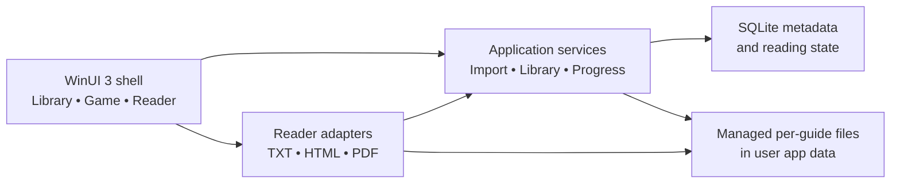

# Desktop Guides: initial requirements and high-level design

Status: proposal, 25 September 2026. This document describes an initial product
scope and architecture; it is not an implementation specification.

## 1. Product intent and assumptions

Desktop Guides is a local-first Windows application for keeping written game
reference material together and returning to the right place during play. A
person creates a game in their library, imports one or more guides, reads without
an internet connection, and can see both their last reading position and whether
they have completed each guide.

This design assumes:

- The first release imports files the user already has. Online guide discovery,
  downloads, accounts, and sync are later work.
- "Track" means automatic resume **per guide**, an approximate reading
  percentage, and a separate, user-controlled completion state. Scrolling to the
  end does not mark a guide complete.
- The first three reader formats are `.txt`, `.html`/`.htm`, and `.pdf`. HTML
  with local image and CSS assets is in scope; saving an arbitrary live website
  for offline use is a separate feature.
- Imported material is copied into an app-managed library. Originals remain
  untouched. Reading an imported guide never requires its original path.

### Reference products and scope

| Reference | Relevant ideas | Decision for this app |
| --- | --- | --- |
| [Pocket Codex](https://www.pocketcodex.app/) | Focused offline TXT, HTML, and PDF reading; several guides per game; automatic per-guide resume; optional sync | Use the reading and library model for the first release. Revisit sync after local storage and conflict rules are proven. |
| [Pixel Guide](https://github.com/rexmont/Pixel-Guide-Android) ([feature summary](https://pixelguide.app/)) | TXT reflow, tables of contents, in-guide search, reader themes, PDF fit-to-width, local HTML, controller use, maps/manuals, and online sources | Include fit-to-width PDF and core reader controls first. Add richer navigation and formats in stages. Do not copy Android-specific UI or integrations. |

The references describe product behavior, not a requirement to reuse their code
or to match every feature.

## 2. Requirements

### First release (MVP)

| ID | Requirement | Observable behavior |
| --- | --- | --- |
| R1 | Organize by game | Create, rename, and remove a game; attach multiple independently tracked guides to it. |
| R2 | Import local guides | Pick TXT, HTML, or PDF files; copy content and supported local HTML assets into managed storage; show a clear error for unsupported, missing, or unreadable files. |
| R3 | Browse the library | See games, their guides, format, last opened date, and reading state; find a game or guide by title. |
| R4 | Read offline | Open any successfully imported guide after disconnecting from the network. No reader view should need a remote resource. |
| R5 | Resume accurately | Reopen each guide near its last visible position after closing the guide, restarting the app, changing window size, or changing text size. |
| R6 | Track completion | Show approximate read percentage and allow `Mark complete` / `Mark in progress` independently of the saved position. |
| R7 | Basic reader controls | Provide previous/next page or scroll, jump to location where appropriate, a remembered TXT/HTML font size per guide, a light/dark reading theme, and PDF fit-to-width. Preserve TXT whitespace for ASCII maps and diagrams. |
| R8 | Library integrity | A failed import leaves no half-created guide; removing a guide requires confirmation and removes its managed copy and reading state. |
| R9 | Windows usability | Support mouse, keyboard, touch, scaling, high contrast, labeled controls, and clear focus order. TXT and HTML text should be screen-reader readable; validate PDF text accessibility during the reader spike. Show an actionable message if a needed runtime is missing. |

### Later candidates, in priority order

1. **Navigation:** in-guide search for TXT/HTML, HTML heading navigation, TXT
   table-of-contents detection, bookmarks, and optional smart TXT reflow. Keep
   a preformatted mode so diagrams remain legible.
2. **More material:** multi-page offline HTML imports, images/maps, CBZ, and
   selected manual formats. Add PDF text search only with a PDF engine that
   exposes text; the proposed MVP renderer exposes page images.
3. **Collection and platform features:** supported online guide sources,
   lawful offline capture, controller shortcuts, multi-window reading,
   annotations, and optional device sync. Each online source
   needs a separate terms, attribution, and failure-handling review.
   Prioritize a manual backup/export before sync.

## 3. Key user flows and UI

The WinUI 3 shell uses a `NavigationView` with a **Library** destination and a
settings entry. The library offers a game list/grid, title search, and an
`Add game` action. A game detail view shows its guides with format, reading
percentage, completion state, and `Import guide`.

Opening a guide shows a reader with a compact top bar (game and guide title,
back, appearance controls, and `Mark complete`) and a collapsible navigation
pane. The reading surface takes the remaining space. PDF adds page number,
fit-to-width, and zoom controls. The UI should remember the last active guide
without automatically opening it on app launch.

Typical flow:

1. Create a game (or choose an existing one), then import a guide.
2. Preview its detected format and title; resolve any HTML asset or TXT
   encoding warning before confirming.
3. Read and navigate. The app saves a location as reading proceeds and when
   leaving the reader.
4. Return from the game detail view to the exact guide. The completion toggle
   remains independent from that location.

Keyboard defaults: `Ctrl+O` imports, `Ctrl+F` searches the library (and later
the active guide), `Esc` closes reader overlays, and `Page Up`/`Page Down`
navigate the reader. All actions must also be reachable in the UI.

## 4. Technical design

### Platform and application structure

- **UI:** C#/.NET with WinUI 3 on the Windows App SDK. Target Windows 11 first
  and validate Windows 10 compatibility; WinUI 3 supports Windows 10 version
  1809 and later. The test matrix should include Windows 11, Windows 10 22H2,
  x64, and ARM64 before promising those combinations publicly.
- **Delivery:** Start with a packaged WinUI 3 application (MSIX). Choose the
  final distribution path and signing approach before release. Check for the
  WebView2 Runtime at startup and make installation or repair understandable
  on Windows systems where it is absent.
- **Separation:** Keep format readers behind a small common contract so the
  library and progress services do not depend on a specific control.

The shared reader contract should cover `Open`, `GetLocation`,
`RestoreLocation`, `GetEstimatedProgress`, and supported commands. A reader can
declare capabilities such as text size, page jump, or text search; the shell
only displays controls the active reader supports. Importers validate and
stage files before one database transaction publishes a new guide.

### Reader strategy

| Format | First implementation | Position anchor | Main limitation |
| --- | --- | --- | --- |
| TXT | Decode into a normalized text model and render through a bounded/virtualized native WinUI text view. Preserve fixed-width layout by default. Offer an encoding choice when detection is uncertain. | Character offset in normalized text plus a small surrounding text fingerprint. | Smart reflow and reliable automatic section detection need separate work. |
| HTML | Render a managed local copy in WinUI 3 `WebView2`; retain supported relative images/CSS. The host reads the current visible element/text position through controlled DOM calls. | Document-relative path, element/text context, and offset; scroll ratio as fallback. | Dynamic scripts and remote resources are outside the offline MVP. Some live-site layouts may look different. |
| PDF | Use `Windows.Data.Pdf` to render pages into a WinUI viewer with page caching, fit-to-width, and zoom. | Zero-based page index plus fractional vertical offset within the page. | This API renders page images. PDF text selection, search, and screen-reader access to document text require a different or additional text-capable engine. |

For HTML, treat every imported document as untrusted. Disable document
JavaScript, host objects, web messages, and unneeded browser features. Allow
navigation and resource loads only for the imported local guide; handle an
external link through an explicit browser action. Reject path traversal,
symlinks outside the selected import root, and unsafe file types while copying
assets. Do not expose the library directory or native app services to the
page. Host-owned DOM queries use fixed scripts and validated results.

### Data and persistence

Keep the initial schema small:

- `Game`: stable ID, title, optional platform/notes, created and updated times.
- `Guide`: stable ID, game ID, title, format, managed relative path, content
  fingerprint, imported time, and optional original source label.
- `ReadingState`: guide ID, format-specific locator with schema version,
  estimated percentage, last opened time, and optional completed time.
- `ReaderPreferences`: guide ID and reader-specific options such as TXT/HTML
  font size. Global appearance settings live in app settings.

Use SQLite for metadata and reading state. Store imported content under a
per-user app-data directory, one guide per subdirectory, with paths relative
to that directory in the database. Keep only copies needed to read the guide
offline. Track progress after meaningful movement, on navigation away, and
on app deactivation; throttle writes during continuous scrolling. Import into
a temporary staging directory, validate, then move into managed storage and
commit the metadata. Clean up staging and any uncommitted managed files on
failure.

The content fingerprint detects replacement or re-import. If content changes,
try the format-specific context anchor before the percentage fallback and
tell the user when the restored location is only approximate. Reading
percentage is an estimate for display, not a source of truth for completion.

## 5. Quality gates and delivery sequence

| Stage | Deliverable | Exit check |
| --- | --- | --- |
| 0. Reader spike | Small WinUI 3 project opening one sample of each format | Confirm TXT whitespace/large-file behavior, HTML offline assets and safe DOM location capture, PDF page rendering and resume, PDF document accessibility needs, plus clean-machine runtime setup. |
| 1. MVP | Library, import, three readers, resume, completion toggle, settings, and packaged build | Reopen position across restarts and layout changes; imported guides work offline; failed imports leave no partial records; keyboard, controls, and TXT/HTML accessibility pass a manual check. |
| 2. Reader depth | Search, TOCs, bookmarks, TXT reflow, manual backup/export, and additional formats | Format-specific tests include ASCII art, varied old TXT encodings, large HTML, image assets, and long PDFs; a backup can be restored into a clean library. |
| 3. Connected features | Optional discovery, downloads, sync, and integrations | Preserve local-first behavior, review source rights/terms, and define conflict recovery before sync ships. |

## 6. Decisions to validate during the spike

1. Can the native TXT view keep navigation smooth for very large legacy guides
   while maintaining a stable character anchor?
2. Does static HTML with disabled page scripts cover the guides users actually
   import? If not, define an explicitly trusted mode instead of silently
   allowing active content.
3. Is page-rendered PDF sufficient for the first release, or do PDF text
   accessibility, selection, and search call for a text-capable engine immediately?
4. Should the initial release include a manual library export/backup before
   introducing any sync mechanism?

## Sources

- [Pocket Codex product page and FAQ](https://www.pocketcodex.app/)
- [Pixel Guide Android repository](https://github.com/rexmont/Pixel-Guide-Android)
  and [feature summary](https://pixelguide.app/)
- [Microsoft: WinUI 3](https://learn.microsoft.com/en-us/windows/apps/winui/winui3/)
- [Microsoft: WebView2 in WinUI 3](https://learn.microsoft.com/en-us/windows/apps/develop/ui/controls/webview2)
- [Microsoft: local content in WebView2](https://learn.microsoft.com/en-us/microsoft-edge/webview2/concepts/working-with-local-content)
  and [WebView2 security guidance](https://learn.microsoft.com/en-us/microsoft-edge/webview2/concepts/security)
- [Microsoft: `IsScriptEnabled` behavior for host-injected scripts](https://learn.microsoft.com/en-us/dotnet/api/microsoft.web.webview2.core.corewebview2settings.isscriptenabled)
- [Microsoft: `Windows.Data.Pdf.PdfDocument`](https://learn.microsoft.com/en-us/uwp/api/Windows.Data.Pdf.PdfDocument)
  and [`PdfPage` rendering](https://learn.microsoft.com/en-us/uwp/api/Windows.Data.Pdf.PdfPage)
- [Microsoft: packaging and deployment options](https://learn.microsoft.com/en-us/windows/apps/package-and-deploy/)
