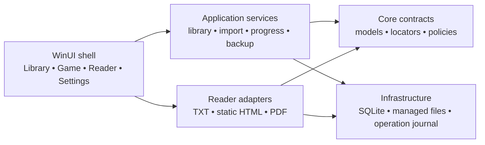

# P1 technical design: local library and first usable reader

Status: design for S03–S17 and S20, 25 September 2026. The M0 contracts and
PDF decision are implemented for review; see [P1 results](p1/results.md).
The [high-level design](initial-design.md) defines R1–R9;
the [work breakdown](work-breakdown.md) owns story, task, and TR IDs; the
[implementation plan](p1/implementation-plan.md) orders the work. P0 was
merged in [PR #1](https://github.com/ilya-slalom/desktop-guides/pull/1).
The [P0 results](p0/results.md) and [reader decisions](p0/reader-decisions.md)
are inputs, including the PDF text-accessibility blocker.

## 1. Scope, assumptions, and decisions

- The initial release imports local TXT, one static HTML entry document with
  local image/CSS assets, and PDF. Multi-document HTML, OCR, in-guide search,
  accounts, and sync stay in P2/P3. An in-document HTML fragment link works;
  an unimported HTML target is reported as unavailable.
- P1 targets Windows 11 x64 first. Native Windows 11 ARM64 is a candidate
  because P0 ran Core and reader fixtures there; the full P1 app still needs
  its own install and workflow check. Windows 10 is deferred and is not an
  advertised target. The user deferred P0's clean-VM prerequisite check;
  T17.3 remains a release gate before claiming clean-install support.
- One interactive app process owns the library. No background sync or
  cross-process writer is designed. Imports copy files; readers never depend
  on the selected original after import. Completion is user controlled.
- Package identity must stay stable after the first public package.
  P0's `ReaderSpike` identity and bundled fixture picker are test assets,
  not the production identity or library UI.

| Decision | Practical alternatives | P1 choice and reason |
| --- | --- | --- |
| App structure | Grow the P0 fixture window, or introduce a shell and application services | Introduce a WinUI shell and retain P0 probes as test-only adapters. Fixture-specific controls and paths cannot become library dependencies. |
| Metadata | JSON files, or SQLite with constraints and transactions | SQLite through `Microsoft.Data.Sqlite`, behind portable contracts. Foreign keys, explicit migrations, and one write coordinator support independent guide state and recovery. |
| Files plus database | Assume one SQLite transaction covers files, or journal cross-boundary operations | Stage and rename app-owned directories, record pending file operations in SQLite, then reconcile on startup. A database transaction cannot roll back a filesystem rename. |
| Content ownership | Package local data alone, or add user export/restore | Use package `LocalFolder` for the live library and promote S20 to P1. Package local data persists through updates but is removed on uninstall; an archive saved outside app data provides recovery when the user exports it. |
| HTML | Reuse a broad virtual-host folder, or explicitly serve verified assets | Extend the P0 per-request allowlist and use a unique synthetic origin per guide. Preview discovers missing local assets before publication; every served byte comes from the managed copy. |
| PDF | Ship the P0 raster viewer with a note, or validate a text path first | The [T10.0 decision](p1/pdf-decision.md) selected a native `Windows.Data.Pdf` preview plus PdfPig text path after the tagged fixture appeared in Windows UI Automation and keyboard selection. T10.1–T10.3 must implement and verify the production adapter before S10/S17 pass. |
| Search | SQLite `LOWER`/`LIKE`, or compare title metadata in Core | Filter loaded title metadata using invariant, case-insensitive comparison, then sort and virtualize the view. No guide bytes are opened for library search. |

The new portable `DesktopGuides.Core` types describe games, guides, locators,
operations, and validation. A new `DesktopGuides.Infrastructure` project owns
SQLite, managed files, import, and archive I/O. `DesktopGuides.App` owns WinUI
views, pickers, WebView2, PDF presentation, and accessibility peers. Headless
integration tests reference Core and Infrastructure; UI automation runs on
Windows. Pin new package versions in `Directory.Packages.props` and lock files
when implementation begins. `Microsoft.Data.Sqlite` executes its async ADO.NET
methods synchronously, so run short database commands on a worker, never on
the UI thread. Use WAL for readers and one serialized writer.



## 2. Storage, identity, and recoverable file operations

### Live layout and path rule

For the packaged app, use
`ApplicationData.Current.LocalFolder.Path/DesktopGuides/` as an app-data
parent. Its live `library/` child contains `library.sqlite`,
`content/<guide-id>/`, `.staging/<operation-id>/`, and
`.trash/<operation-id>/`. Sibling `.restore/`, `.recovery/`, and
`restore-state.json` support whole-library replacement without renaming a
directory into itself. Put transient WebView2 profiles under
`LocalCacheFolder`, outside backup scope. Tests inject a temporary parent.
Only a generated `Guid` in `"N"` form names a guide directory. Database paths
are forward-slash relative paths within that directory; no original absolute
path is stored. Keep a sanitized basename only as an optional source label.
After the first successful import, show a dismissible reminder that uninstall
removes the live library and that Export in Settings saves a user-owned copy.
Reject archive destinations inside the package's app-data parent.

Resolve a stored path by checking each segment for empty, `.`, `..`, colon,
backslash, NUL, drive or UNC syntax, and reparse points. Canonicalize under
the expected guide root, require the result to stay inside it, and repeat the
link check immediately before opening. The attacker model covers hostile
imported paths and static assets; a separate local process racing filesystem
renames is outside P1. Never recurse into unknown directories during cleanup.

### Initial schema and invariants

Schema v1 establishes the tables below; schema v2 adds the last-opened-time
index. New databases apply both versions in order and finish with
`PRAGMA user_version=2`. Use `Guid` text IDs, UTC Unix-millisecond integers,
parameterized SQL, `CHECK` constraints for bounded strings and fractions,
and `PRAGMA foreign_keys=ON` on **every** connection. `ON DELETE CASCADE`
handles dependent rows inside the database; only application services may
invoke deletes because files need separate coordination.

| Table | Required fields and constraints |
| --- | --- |
| `Games` | `Id` primary key, trimmed `Title` (1–160), optional `Platform` (up to 80) and `Notes` (up to 2,000), `CreatedUtcMs`, `UpdatedUtcMs`. |
| `Guides` | `Id` primary key, `GameId` foreign key to Games, title (1–200), format enum, unique `ManagedRelativeRoot`, `PrimaryRelativePath`, `ContentSha256`, `ContentBytes`, optional source label, nullable TXT-only `TextCodePage` (437 or 1252), `ImportedUtcMs`, `UpdatedUtcMs`. |
| `ReadingStates` | `GuideId` primary/foreign key, nullable versioned locator JSON, nullable estimated fraction in `[0,1]`, nullable `LastOpenedUtcMs`, nullable `CompletedUtcMs`. A new guide has no estimated fraction. |
| `ReaderPreferences` | `GuideId` primary/foreign key, nullable TXT/HTML font scale within the permitted range. |
| `Settings` | Key/value rows for system/light/dark theme and last active guide ID; a stale guide ID is ignored at launch. |
| `FileOperations` | Operation ID, `Import`/`DeleteGuide`/`DeleteGame`, `Prepared`/`Committed` phase, validated JSON manifest of generated guide IDs and app-owned paths, creation time. Stable for startup recovery. |

Create `Guides(GameId)` in v1 and `ReadingStates(LastOpenedUtcMs)` in v2. Do
not duplicate a global reading position on Game or filename. Invariant/culture-independent
title comparison is performed on metadata in Core so non-ASCII case behavior
does not depend on SQLite's built-in `NOCASE`; paginate **after** filtering.
Reassess query strategy only if measured libraries make this too slow.
For TXT/PDF, `ContentSha256` is the copied file hash. For HTML, it is SHA-256
of a canonical sorted list of managed relative paths and each file's SHA-256,
so an asset change also changes the guide fingerprint.

### Cross-boundary protocol

All mutating operations acquire a single library write gate. An **import**
commits a `Prepared` FileOperations row, copies and hashes source bytes under
`.staging`, validates them, renames the staged guide directory into `content`
on the same volume, then inserts Guide and empty state rows and removes the
operation row in one SQLite transaction. An exception rolls back owned files.
At startup, a prepared import with no Guide row removes only its named staged
or newly moved directory; a committed Guide row is never removed by a janitor.
The UI lists only committed Guide rows.

A **guide or game deletion** first writes a `Prepared` operation naming all
owned guide IDs, moves their directories to `.trash/<operation-id>`, then
deletes metadata and marks the operation `Committed` in one transaction.
If move or commit fails, restore any moved directories and keep metadata.
At startup, `Prepared` deletion with remaining database rows restores files;
`Committed` deletion removes its exact trash paths and then its operation
row. A missing file does not justify deleting other files. This is
recoverable, not a claim of one atomic transaction across SQLite and NTFS.
Cancel occurs before the operation is written and changes nothing.

On startup, run schema validation/migration, reconcile known operations,
then detect untracked directories under `content` without deleting them.
Surface missing/corrupt managed guides as repairable rows. If the database is
corrupt, stop publication and offer the recovery copy; never initialize an
empty replacement over the existing file.

### Migrations and backup

Before a schema upgrade, create a consistent recovery database with
`SqliteConnection.BackupDatabase`; a plain copy of a live WAL database is
insufficient. Apply each forward migration and `user_version` change in one
transaction, then run both `integrity_check` and `foreign_key_check`. Failure
rolls back and leaves the old file/copy for recovery. A populated v1 fixture
must upgrade to v2 with the last-opened index and all rows intact.
Do not execute SQLite I/O on the WinUI dispatcher.
Keep named migration recovery copies under the app-data `.recovery/` sibling
of the live library, so a later whole-library replacement cannot remove them.

## 3. Reader contract, locators, and UI state

Use a typed reader interface in App because `FrameworkElement` is WinUI
specific. Its model arguments and results live in Core:

```csharp
interface IReaderAdapter : IAsyncDisposable
{
    GuideFormat Format { get; }
    ReaderCapabilities Capabilities { get; }
    FrameworkElement View { get; }
    event EventHandler<LocationChangedEventArgs> LocationChanged;
    Task OpenAsync(ManagedGuideSource source, CancellationToken token);
    Task<ReaderLocation> GetLocationAsync(CancellationToken token);
    Task<RestoreOutcome> RestoreLocationAsync(ReaderLocation location,
                                              CancellationToken token);
    Task ApplyAppearanceAsync(ReaderAppearance appearance, CancellationToken token);
}
```

`ManagedGuideSource` is created only by the resolver after a committed Guide
lookup; it is never supplied by a web page. Capability flags cover text size,
page jump, fit width, find, and selectable text. The shell composes commands
from flags; unsupported commands are hidden or announced unavailable.
Adapters send movement notifications, but never write SQLite directly.
Opening a new guide increments a reader-session generation; obsolete
captures/renders from an old generation cannot overwrite new guide state.

`ReaderLocation` is a bounded JSON envelope with `format`, `schemaVersion`,
`contentSha256`, `payload`, and `estimatedFraction`. Store at most 4 KiB of
locator JSON; reject non-finite numbers, unknown path segments, wrong format,
and oversized quotes. TXT payload is normalized UTF-16 offset plus context
quote; HTML is relative document, ID/text context, delta and scroll fraction;
PDF is zero-based page plus within-page fraction. `RestoreOutcome` is
`Exact`, `Context`, `Approximate`, or `Unavailable` with an optional user-facing
reason. Unknown future versions yield `Unavailable` and leave the guide open
at a safe start. Invalid values are clamped or rejected without changing
completion.

Debounce meaningful movement for roughly one second and guarantee that a
normally running app writes the latest changed location within five seconds
of the last movement. Serialize captures and writes by guide/session; flush
on navigation, window deactivation, and closing. Windows App SDK desktop
apps do not use UWP automatic suspension, so use window activation and
`AppWindow.Closing` rather than a UWP suspend hook. Never write on every
scroll event. An empty ReadingState is displayed as `Not started`, not 0%.

## 4. WinUI shell and interaction direction

The visual direction is a quiet reading workspace: a compact `NavigationView`
for Library/Settings, a clear Game title and guide list, and a reader surface
that uses most of the window. Favor native WinUI typography, spacing, theme
brushes, and visible focus states. Avoid fixture terminology in production
copy. At narrow widths collapse the navigation pane before squeezing text;
the reader toolbar wraps or moves low-priority commands into an overflow menu.
High contrast uses system brushes, never hard-coded HTML colors without a
matching local style. A screen-reader announcement distinguishes approximate
restore, missing managed content, and completion changes.

`NavigationView` does not manage a back stack automatically. A shell
navigation coordinator owns `Library`, `Game(gameId)`, `Reader(guideId)`, and
`Settings`, keeps selected IDs stable across edits, and returns Reader to its
own Game. Launch opens Library and may show a `Resume last guide` action; it
does not auto-open that guide. A dialog or overlay returns focus to its
invoking control. Every shortcut has a visible matching command.

The P0 fixture picker and test assets remain available only in a separate
CI/development probe mode. A production MSIX does not bundle the P0 corpus
or expose fixture controls. CI must keep one diagnostic package lane for P0
reader regressions and add a production-mode library/import workflow lane.

## 5. Security, failure, and acceptance budgets

- Import uses cancellation-aware streaming copies and SHA-256. The starting
  validation limits are TXT 64 MiB, PDF 1 GiB, HTML entry 16 MiB, 2,048 static
  assets, 32 MiB per asset, and 256 MiB total HTML tree. These are explicit
  P1 safety bounds, shown in preview errors and revisited with real samples.
  They are not claims about every guide on the internet.
- Accepted static HTML support is the entry `.html`/`.htm` document, local
  `.css`, and PNG/JPEG/GIF/WebP images. SVG, scripts, frames, fonts, media,
  forms, external assets, and additional HTML documents are unsupported in
  P1; import warns about references and the reader blocks them. Use an HTML
  and CSS parser, not regex alone, to discover `src`, `srcset`, CSS `url()`,
  and nested `@import`. Pin and license-review parsers before T07.1 is done.
- WebView2 loads a synthetic HTTPS origin unique to one managed guide. The
  P0 request-handler allowlist, hash check, navigation/popup blocking, denied
  permissions/downloads, disabled document scripts/host objects/web messages,
  and fresh-profile canary tests remain mandatory. Fixed host DOM scripts
  check the current origin and validate returned JSON before storage.
- Service errors have stable codes (`UnsupportedFormat`, `MissingSource`,
  `EncodingChoiceRequired`, `UnsafeAsset`, `MissingManagedFile`,
  `StorageUnavailable`, `PasswordRequired`, `PdfTextUnavailable`). UI copy
  gives one action, such as Retry, Choose encoding, Remove broken guide,
  Repair WebView2, or Export recovery copy. Logs omit guide text, passwords,
  original absolute paths, and WebView2 profile contents.
- [T10.0](p1/pdf-decision.md) compares a WebView2 PDF surface and a separately licensed text
  extraction/rendering path against `pdf-access`, `pdf-scan`, `pdf-locked`,
  `pdf-long`, offline use, page-fraction restore, selection, Narrator/UIA text,
  and redistribution. A hybrid P0 raster preview plus a selectable native
  text view is eligible only if the tagged fixture has credible reading
  order. A scanned fixture needs an honest image-only label; OCR is P2.
  Record the chosen engine and a failed-candidate matrix before T10.1.
  If no candidate passes, S10 and S17 stay blocked; PDF is not silently
  removed from R2.

## 6. Task design: persistence, library, and import

### S03 — Persist the local library

- **T03.1** Add Core records and repository interfaces for Game, Guide,
  ReadingState, ReaderPreferences, and Settings; implement the schema above
  in Infrastructure. Use generated IDs and UTC timestamps from an injected
  clock. The repository exposes guide-scoped state and transactional
  service methods, not public `DeleteGame` SQL. Tests insert two guides under
  one game and show that their locators and completion fields cannot collide.
- **T03.2** Add ordered migration scripts keyed by `user_version`, backup
  before migration, transaction rollback, and integrity/foreign-key checks.
  Keep a populated schema-v1 fixture and upgrade it to v2; inject a migration
  failure midway and verify the original data or recovery copy still opens.
  Unknown newer schema versions fail with a clear "update the app" message
  instead of downgrading or creating an empty database.
- **T03.3** Add `ILibraryPaths` and `ManagedPathResolver` with an injectable
  test root. It creates only app-owned directories and returns paths beneath
  the generated guide ID. Test `..`, absolute, UNC, mixed slash, encoded
  separator, symlink/junction, missing segment, and a normal nested asset on
  Windows. The resolver is reused by import, readers, backup, and deletion.

### S04 — Manage games and their guides

- **T04.1** Add `Add game` and `Edit game` WinUI dialogs with trimmed title,
  optional platform/notes, length feedback, and Save disabled until valid.
  Duplicate titles are allowed because distinct editions/platforms can share
  a name; stable IDs disambiguate them. Cancel closes without a repository
  call. Test keyboard submission, errors, and Unicode names.
- **T04.2** Show game details and rename/remove actions bound to the game ID.
  A rename updates `UpdatedUtcMs`, keeps guide IDs and reading state intact,
  refreshes Library/Game breadcrumbs, and preserves list selection. An
  interrupted update shows a retryable message instead of returning to a
  stale view.
- **T04.3** Count affected guides before a removal dialog and require the
  user's explicit Remove action. Pass game ID plus expected count to the
  service; if the count changed, refresh the dialog rather than deleting an
  unexpected set. Use the multi-guide trash protocol in section 2. Verify
  confirmed, canceled, failed-move, failed-commit, and startup-recovery
  cases; no unrelated game directory is touched.

### S05 — Browse and find library entries

- **T05.1** Render a virtualized Game collection ordered by last activity,
  then title and stable ID. Game detail rows show guide title, format,
  last-opened local display time, nullable estimated percentage, and explicit
  completion state. Use data-bound view models, not guide-file parsing during
  listing. Verify large synthetic metadata lists keep bounded realized UI
  items.
- **T05.2** Filter game and guide titles with Core's invariant
  case-insensitive comparison; debounce input only for UI work, not network
  calls. Provide distinct empty-library, loading, and no-results views and
  a visible Clear search action. Unread rows say `Not started`; `0%` appears
  only after a real saved estimate. Test mixed-case and non-ASCII titles.
- **T05.3** Route by IDs rather than row indices. After rename, deletion, or
  import, preserve the selected game/guide when it still exists; otherwise
  move focus to the nearest safe list row or heading. Restore the prior
  Library query on Back and prevent a stale async refresh from replacing a
  newer selection.

### S06 — Import without partial records

- **T06.1** Use a packaged-desktop file picker owned by the current window.
  Open a preview scoped to a selected Game ID, with a suggested title,
  detected format, source basename, size, TXT encoding choice, and HTML
  asset warnings. The picker or preview may be canceled without creating a
  FileOperation or managed directory. A progress view offers Cancel during
  copy and validation.
- **T06.2** Validate extension **and** readable format. TXT tries BOM and
  strict UTF-8, then requires an explicit CP437/Windows-1252 choice when
  decode fails; store the code page. HTML runs the static dependency scan
  from S07. PDF checks readable pages and whether a password is required;
  a password is never persisted. If the selected PDF engine cannot handle
  an encrypted file, reject it before publication with a concrete reason.
  Produce a typed validated ImportManifest rather than passing raw picker
  paths into reader code.
- **T06.3** Allocate Guide and Operation IDs, commit the prepared journal row,
  stream-copy into `.staging`, compute SHA-256 and byte counts, validate again
  after copy, rename to the final generated directory, then publish all
  metadata in one transaction. A successful import opens after the original
  is moved or deleted. Inject cancellation, disk-full/copy error, hash
  mismatch, rename error, and failed SQL commit; no half-created Guide is
  listed and all app-owned residuals are reconciled.
- **T06.4** Compare fingerprint plus format within the selected game before
  publishing. Show `Open existing` or `Import another copy` for an unchanged
  duplicate; never overwrite in place. A second copy gets a new Guide ID,
  so its reading state is independent. Missing, unsupported, encrypted, and
  unreadable sources have distinct error codes. Replacement of an existing
  guide's bytes is a later explicit workflow, not a side effect of import.

### S07 — Keep imported HTML static and offline

- **T07.1** Parse the selected entry HTML and reachable local CSS into a
  bounded dependency graph. Enumerate relevant `src`, `srcset`, stylesheet
  links, inline CSS `url()`, and nested `@import`; normalize fragment/query
  handling before resolving a path. Stage only supported local CSS/images,
  preserving safe relative names, then hash each file. Cycles terminate
  through a visited set; excess depth/count/bytes yields a preview error.
  Pin and license-review the chosen HTML/CSS parser and test nested CSS and
  image variants.
- **T07.2** Resolve every referenced path against the selected HTML root,
  reject `..`, absolute paths, encoded escapes, symlink/junction traversal,
  unsupported type, and case-colliding destinations. Report missing files
  and blocked remote references in preview before Confirm. Revalidate
  staged paths and hashes before publishing; a source asset changed during
  preview cannot silently change the imported result.
- **T07.3** Serve only a per-guide manifest allowlist from WebView2's
  `WebResourceRequested` handler at the unique synthetic origin. Deny all
  other requests, navigation, new windows, permissions, and downloads;
  disable document scripts, host objects, and web messages. Internal
  fragments remain in the view. An external URL is canceled and shown in an
  app-owned confirmation bar; only its explicit Open action invokes the
  system browser. A fresh-profile canary test covers HTML attributes,
  CSS imports, redirects, and attempted cross-guide URLs with zero
  guide-originated network requests.

## 7. Task design: reader adapters and shell

### S08 — Read legacy TXT faithfully

- **T08.1** Extract P0 decoding and `TextGuideDocument` into the managed-guide
  reader path. Normalize CRLF/CR to LF after decode, preserve spaces/tabs,
  use UTF-16 offsets, and persist the chosen encoding with Guide metadata.
  A BOM wins over a stored fallback code page; a contradictory metadata
  value is treated as a recoverable validation error. Test mixed newlines,
  CP437, Windows-1252, BOM, invalid UTF-8, and file truncation.
- **T08.2** Keep a native virtualized list and default monospace,
  no-wrap presentation with horizontal scrolling for diagrams. Retain one
  normalized text buffer and line-start index; provide visible line slices
  lazily so a 10 MiB guide does not duplicate one string per source line.
  Compare first-text time, realized controls, and window-response samples
  with P0 on the Windows 11 x64 reference host. A size-limit rejection is
  explicit; the reader never silently drops trailing text.
- **T08.3** Expose page up/down, start/end, and a normalized offset/context
  capture/restore path through `IReaderAdapter`. Exact unchanged-file
  restore returns within one visible logical line after width/font change;
  changed bytes try nearest matching context, then a labeled approximate
  fraction. Test repeated quotes, invalid offsets, and guide switching.

### S09 — Read imported HTML

- **T09.1** Bind the P0 restricted WebView2 surface to one committed managed
  Guide ID and its allowlist. Remove fixture staging and use an isolated
  cache profile that is disposed and later swept if WebView2 holds a lock.
  Refuse a missing/mismatched managed asset instead of falling back to a
  source path or network URL. TXT and PDF still open if WebView2 is missing.
- **T09.2** Apply a fixed app-owned local style for system/light/dark theme
  and bounded per-guide text scale; never download fonts or theme assets.
  Preserve the source's static structure where possible and use high
  contrast system choices. Test that changing theme/font while offline does
  not allow a CSS resource outside the guide root.
- **T09.3** Capture a validated, document-relative visible ID/text quote and
  delta with bounded scroll-fraction fallback. Restore after navigation and
  image settling, prefer element/context, then percentage; report
  `Approximate` when bytes or document path changed. Reject non-finite,
  oversized, wrong-guide, and cross-directory DOM results. Test wide/narrow
  reflow, delayed image layout, fragment navigation, and an unimported HTML
  link. P1 supports only the imported entry document and its fragments;
  S21 owns multi-document HTML.

### S10 — Read PDF manuals

- **T10.0** Run the decision matrix in section 5 before building the final
  adapter. Record the candidate/version/license, tested PDF hashes,
  UIA/Narrator text behavior, keyboard selection, offline status, page
  locator control, memory, and failure handling in `docs/p1/pdf-decision.md`.
  A tagged paragraph must be readable as document text; a scanned page
  must not falsely claim text. This is a blocking gate, not a release note.
- **T10.1** Implement the selected engine behind a `PdfReaderAdapter`.
  Reuse P0 page-cache logic only if compatible with the text path. Bound
  rendered images by measured bytes (initial cap 96 MiB), cache by document
  fingerprint/page/render width, and ignore stale render generations after
  rapid navigation or zoom. Dispose page/text handles on close. Test 200-page
  turns and a long session without retaining every page.
- **T10.2** Provide page count, validated page-number entry, Previous/Next,
  fit-width, zoom, and visible matching keyboard commands. Keep toolbar
  focus and reading focus separate so a page turn does not strand Narrator.
  Wrong password shows a retryable message; clear the attempted password
  after each attempt and never write it to storage/logs.
- **T10.3** Persist zero-based page index, within-page fraction, document
  fingerprint, and locator version through the common reader envelope.
  Clamp old/out-of-range pages to valid bounds and return `Approximate` on
  changed bytes. Restore page exactly and vertical fraction within 0.1
  page after resize/zoom on `pdf-long`; confirm the text view refers to the
  same selected page. OCR for `pdf-scan` remains out of scope.

### S11 — Provide a consistent reading shell

- **T11.1** Replace the fixture window with the `NavigationView` route
  coordinator in section 4. Library, Game, Reader, and Settings share one
  window and stable ID-based back navigation. Start at Library, show an
  optional Resume action, and handle missing last-guide IDs. Keep a
  build-time diagnostic probe mode for P0 CI without shipping fixtures in
  the production package.
- **T11.2** Define the typed reader adapter/capabilities in section 3 and
  test command dispatch with fake adapters. Only the active adapter knows
  its control tree; the shell receives commands, locations, progress, errors,
  and capability changes as typed values. The production TXT/HTML/PDF
  adapters implement this contract in M3; P0 diagnostic probes retain their
  existing interface until T11.1 separates the production shell.
- **T11.3** Build a compact reader title/back bar, collapsible navigation
  area, reader content host, status/approximate-restore announcement, and
  capability-based command slots. Narrow windows move secondary commands
  to overflow; essential Back and reader movement remain available. Verify
  Library → Game → Reader → Game by keyboard and pointer without losing
  query, selection, or guide state.

## 8. Task design: tracking, preferences, and recovery

### S12 — Resume each guide independently

- **T12.1** Define the versioned locator envelope and format payloads in
  section 3 in Core, plus per-format parsers and `RestoreOutcome`. Exact
  fingerprint and context matches precede approximate fraction fallback.
  Tests round-trip all three formats and reject old/unknown versions,
  malformed JSON, out-of-range values, and wrong-guide document paths
  without touching completion.
- **T12.2** Put a `ProgressCoordinator` between adapters and ReadingStates.
  It observes movement, deduplicates unchanged anchors, debounces capture,
  and writes within five seconds after the final movement. Flush during
  Reader exit, `Window.Activated` loss, and window closing; a generation
  token prevents delayed writes to the next Guide ID. An injected clock and
  fake repository prove continuous scroll does not produce one write per
  event and two guides retain independent positions after restart.
- **T12.3** Estimate TXT fraction from normalized offset, HTML fraction
  from validated document/scroll information, and PDF fraction from
  `(pageIndex + pageFraction) / pageCount`, clamped to `[0,1]`.
  Store the content fingerprint with the locator. On changed bytes, ask
  the adapter for context restoration, then label a percentage-only result
  `Approximate`. `LastOpenedUtcMs` updates only on a successful open.

### S13 — Track completion explicitly

- **T13.1** Put `Mark complete` / `Mark in progress` in the Reader and
  guide-detail actions, using the same Guide ID service method. Update the
  library row and reader command from the committed state; announce the
  result to screen readers. Reaching the last line/page never calls this
  method. A disabled action explains a storage error instead of appearing
  to succeed.
- **T13.2** Change only `CompletedUtcMs` in one SQLite transaction and leave
  `LocatorJson`, estimate, and last-opened time intact. Marking in progress
  clears the completion timestamp; repeating the same action is idempotent.
  Tests toggle twice, restart, and verify that 100% estimated progress does
  not create a completion timestamp.

### S14 — Remember reader appearance

- **T14.1** Store per-Guide TXT/HTML text scale (initially 0.75–2.0 of the
  16-unit default, equivalent to 12–32 WinUI font units) in
  ReaderPreferences. Show Smaller/Larger and a current value with bounded
  steps; PDF uses its separate zoom value and is not written into text
  preferences. Test that changing one guide leaves another unchanged after
  restart and never collapses TXT whitespace.
- **T14.2** Store global `System`, `Light`, or `Dark` in Settings; System is
  the default. Bind WinUI brushes and fixed local HTML CSS to the effective
  theme; Windows high contrast takes precedence over the preference.
  Do not reference remote fonts, images, or styles. Test launch, theme
  change, and restart while disconnected.
- **T14.3** Capture a guide locator before a size/theme transition, apply
  appearance, wait for layout, and restore through the same adapter.
  TXT should remain within one logical line; HTML should return to the
  same context when it exists; PDF page/fraction behavior is unaffected.
  Record an approximate notice when a stable anchor cannot be found.

### S15 — Recover from library and import errors

- **T15.1** Catch database, missing-file, invalid-content, and runtime
  failures at the service boundary and map them to stable error codes and
  actions. A missing managed file keeps its Guide row visible with `File
  missing` status and offers Remove; other guides still open. A bad
  database/migration shows recovery-file location and stops writes until
  repaired, instead of generating a new empty library.
- **T15.2** Reconcile only FileOperations-owned staging/trash paths on
  startup. Enumerate untracked directories for a diagnostic `Review
  orphan` count but do not auto-delete them. WebView2 cache/profile cleanup
  is separate and never follows links into content. Test interrupted import
  at each protocol phase and malformed/unowned directory names.
- **T15.3** Confirm guide removal with title and owned-file count, then use
  the single-guide trash protocol. Delete Guide, ReadingState, and
  ReaderPreferences in one database transaction; preserve unrelated Game
  and Guide rows. A failure before commit restores the directory, and a
  post-commit cleanup failure retains only a known trash entry for retry.
- **T15.4** Add fault-injection integration tests for copy failure, crash
  after stage, crash after rename, failed database commit, failed trash move,
  canceled removal, committed removal, and startup recovery. Verify both
  SQLite rows and exact app-owned paths after each scenario. Keep these
  tests headless; a smaller WinUI check validates error copy and focus.

### S16 — Support Windows input and accessibility

- **T16.1** Map `Ctrl+O` to Import in a Game context, `Ctrl+F` to Library
  title search, `Esc` to the active dialog/reader overlay, and Page Up/Down
  to the active reader's supported movement. Other contexts leave a
  shortcut unavailable without hijacking typed text. Document shortcuts
  in Settings/menus and test each with visible command parity.
- **T16.2** Audit keyboard tab order, visible focus, return focus after
  dialogs/overlays, AutomationProperties names/states, touch hit targets,
  Windows display scaling, high contrast, and Narrator on the real WinUI
  interface. TXT and static HTML document text must be reachable and read,
  not merely their toolbar labels. Record keyboard-only and screen-reader
  traces for Add game → Import → Read → Mark complete → Export.
- **T16.3** Re-run tagged and scanned PDF document-text checks on the
  selected T10.0 engine, including page changes and an error/password
  state. Record UIA text, selection, Narrator reading, and any honest
  scanned-image limitation in the user-facing help/release note. An
  inaccessible tagged PDF blocks S10/S17 even if the bitmap looks correct.

## 9. Task design: backup and release

### S20 — Export and restore a local backup

- **T20.1** Define a versioned ZIP manifest with archive version,
  application/schema version, export time, IDs, each relative managed path,
  byte length, and SHA-256. Hold the library write gate and reconcile all
  known FileOperations before taking a `BackupDatabase` snapshot and copying
  immutable managed files. If recovery is incomplete, fail export. The
  database and content must describe one state. Do not include original source
  paths, passwords, diagnostic logs, temp directories, or WebView2 profile
  data. Stream the archive into a temporary sibling of the user-selected
  destination and rename only after full checksum verification; cancellation
  removes that temporary output.
- **T20.2** Validate archive version, supported schema version, entry count,
  expanded size, duplicate and escaping names, hashes, database integrity,
  foreign keys, and all managed-guide references in a staging root before
  touching the live library. Canonical export destinations must be outside
  the package's app-data parent;
  the Settings flow and first-import reminder explain why. P1 choices are
  Cancel or Replace after a count summary; merging two libraries is deferred.
  For Replace, close database/readers, write a restore marker outside the
  live root recording whether a prior library exists, rename that root to
  `.recovery` if present, promote staging, reopen and verify, then remove the
  marker. On failure or interrupted startup, quarantine an unverified
  promoted root and restore the prior root, or an empty library if none
  existed. Test a clean restore, populated replacement, cancel,
  corrupt/truncated ZIP, zip traversal, oversized expansion, and a forced
  swap failure.

### S17 — Package and verify the MVP

- **T17.1** Choose the final MSIX identity/publisher before a public
  package, set four-part versioning and tested x64 output, and specify how
  Windows App Runtime and Evergreen WebView2 prerequisites are delivered
  online/offline. Use a protected signing service or secret-backed release
  job; keep private signing material out of source and logs. ARM64 output
  may be offered only after the complete P1 workflow passes natively.
  Preserve one package identity across upgrades and test version increase.
- **T17.2** Keep locked restore, Core and Infrastructure headless tests,
  architecture-labeled package builds, and the P0 diagnostic fixture suite.
  Add a production-mode Windows UI workflow: create game, import each
  format, remove originals, restart, resume independently, toggle
  completion, export, restore, and remove. CI failing storage/security tests
  must block packaging; a failing UI workflow must block release promotion.
  Save anonymized fixture IDs, hashes, package and OS/CPU versions, timing,
  accessibility, and cleanup evidence.
- **T17.3** On every promised target, install a signed release candidate,
  upgrade it, import guides, disconnect network, restart, resume, and
  restore a backup into a clean installation. Observe actual missing
  Windows App Runtime and WebView2 behavior and offline-installer recovery
  on a disposable runtime-free Windows 11 x64 VM before a clean-install
  claim; the user deferred that P0 check, so this lane remains pending
  until such a target exists. Start with Windows 11 x64. Windows 10 stays
  unadvertised; ARM64 is added only with its own native full-workflow
  result. Publish a tested matrix and the scanned-PDF/OCR limitation.

## 10. Verification gates and design references

Every P1 task closes with a code or documentation artifact, a named test or
manual trace, and a reviewable result. The [implementation plan](p1/implementation-plan.md)
lists dependencies and specific exits for all 49 tasks. Core/Infrastructure
tests run on the locked Windows CI toolchain; critical file-boundary and
symlink tests also run on Windows NTFS. UI Automation, Narrator, high
contrast, DPI, installed-package, and offline checks run on target Windows
sessions. `docs/p1/results.md` will record actual outcomes during
implementation; this design makes no unrun compatibility claim.

Primary references used for these decisions:

- [Microsoft: ApplicationData local data lifetime](https://learn.microsoft.com/en-us/windows/apps/design/app-settings/store-and-retrieve-app-data)
  and [app data after uninstall](https://learn.microsoft.com/en-us/windows/msix/desktop/desktop-to-uwp-behind-the-scenes).
- [Microsoft: Microsoft.Data.Sqlite asynchronous limitations](https://learn.microsoft.com/en-us/dotnet/standard/data/sqlite/async),
  [connection strings and foreign keys](https://learn.microsoft.com/en-us/dotnet/standard/data/sqlite/connection-strings),
  and [SQLite backup API](https://learn.microsoft.com/en-us/dotnet/standard/data/sqlite/backup).
- [SQLite: foreign keys](https://www.sqlite.org/foreignkeys.html),
  [transaction atomicity](https://www.sqlite.org/atomiccommit.html), and
  [online backup](https://www.sqlite.org/backup.html).
- [Microsoft: desktop FileOpenPicker](https://learn.microsoft.com/en-us/windows/apps/develop/files/using-file-folder-pickers),
  [NavigationView](https://learn.microsoft.com/en-us/windows/apps/design/controls/navigationview),
  and [desktop lifecycle](https://learn.microsoft.com/en-us/windows/apps/windows-app-sdk/applifecycle/applifecycle).
- [Microsoft: WebView2 security](https://learn.microsoft.com/en-us/microsoft-edge/webview2/concepts/security),
  [local content](https://learn.microsoft.com/en-us/microsoft-edge/webview2/concepts/working-with-local-content),
  and [PDF toolbar options](https://learn.microsoft.com/en-us/microsoft-edge/webview2/reference/winrt/microsoft_web_webview2_core/corewebview2pdftoolbaritems?view=webview2-winrt-1.0.4022.49).
